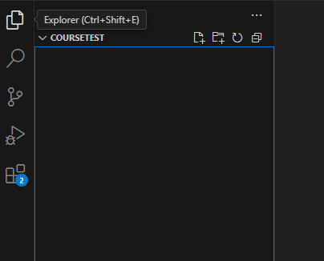

# Урок 1. Устанавливаем программы и пишем простую программу

!!! Abstract "Саня, привет! :D"
    А может быть и Диме привет? :) Дима, читаешь нет? Хе-хе-хе :D

    Я думаю что мы начнем потихоньку разбираться с программированием. Путь долгий, трудный, но в итоге ты сможешь писать свои программы, боты, сайты, вообще что захочешь.
    
    Каждый раз думай что было бы интересно сделать. Если идей не будет, то будем делать что я придумаю.
    
    Если ничего не придумаешь, дальше будем делать простой калькулятор, но сегодня мы просто подготовим компьютер и напишем очень простую программу. А потом начнем потихоньку выяснять детали и писать что то сложнее. 

    Уверен все получится!

    Люблю, целую!

В этом уроке ты:

- установишь Node.js
- установишь редактор кода VS Code
- создашь файл с кодом
- запустишь свою первую программу «Привет, мир!»

После этого урока компьютер будет готов к программированию, а у тебя будет первая работающая программа.

## Что нам понадобится

Мы будем устанавливать две программы:

- Node.js — чтобы запускать программы
- VS Code — чтобы писать код

## Установка Node.js

1. Скачай файл
<https://nodejs.org/dist/v24.12.0/node-v24.12.0-x64.msi>
1. Запусти установку  
Везде нажимай Next / Далее, ничего не меняй

## Проверка установки Node.js

1. Нажми Win + R  
2. Введи cmd  
3. Нажми Enter  

В открывшемся окне напиши:

```
node -v
```

Если ты видишь что-то похожее на:

```
v24.12.0
```

Значит Node.js установлен правильно.

Если команда не работает — перезапусти компьютер и попробуй снова.

## Установка редактора кода VS Code

1. Открой сайт  
<https://code.visualstudio.com>

2. Нажми Download for Windows

3. Установи программу  
Просто нажимай Next / Далее

## Создаём папку для первой программы

1. Создай новую папку на компьютере  
2. Назови её, например:

```
my-first-program
```

## Открываем папку в VS Code

1. Запусти VS Code  
2. Нажми File → Open Folder  
3. Выбери папку my-first-program там где ты ее создал

## Создаём первый файл с кодом

1. В VS Code создай новый файл - кнопка в виде файла с плюсиком
   
2. Назови его:
```
index.js
```
3. Напиши в файле следующий код:
```
console.log("Привет, мир!");
```
  !!! question "Что тут происходит?"
    - console - это специальный объект который позволяет работать с терминалом (или консолью)
    - log - это специальная функция, которая может написать в терминале какой то текст. Позже мы разберем что такое функция и как делать свои функции.
    - "Привет, мир!" - это то, что ты хочешь написать в терминале. Можешь поменять текст на любой другой и посмотреть что будет. Очень важно что бы текст был в кавычках, иначе компьютер не поймет где начало, а где конец того текста, который ты хочешь показать.
1. Сохрани файл (Ctrl + S)

## Запуск первой программы

1. В VS Code открой терминал  
Terminal → New Terminal

2. В терминале введи команду:

```
node index.js
```

## Результат

Если всё сделано правильно, ты увидишь:

```
Привет, мир!
```

Поздравляю. Ты написал и запустил свою первую программу.

## Что ты теперь умеешь

- устанавливать Node.js
- пользоваться VS Code
- создавать файлы .js
- запускать программы через терминал
- писать простейшие программы

## Если что-то не работает

Это нормально.

Проверь:
- файл называется index.js
- команда node -v работает
- терминал открыт в папке с файлом

В следующем уроке мы разберём, как компьютер понимает команды.